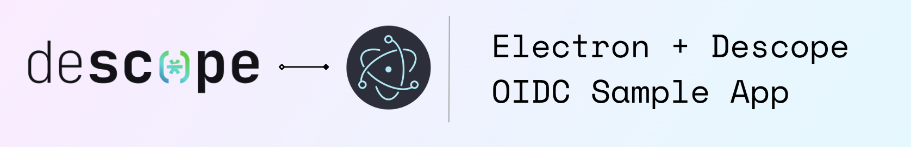

# Electron + Descope OIDC Sample App

This app showcases how to implement OIDC into any Electron application with Descope, allowing for seamless and secure authentication in your desktop app. This app is written in basic HTML, JS, and CSS, so it's great for all experience levels. 

## Features

- **Secure Authentication**: Utilizes Descope for user authentication.
- **Customizable Experience**: Easy-to-change authentication flows for quick implementation.
  
## Getting Started
Follow these steps to clone the repository and start using the app.

### Prerequisites 

- An account on [Descope](https://descope.com/).

### Clone the Repository

Start by cloning the repository to your local machine:

```bash
git clone https://github.com/descope-sample-apps/electron-oidc-sample-app.git
cd electron-oidc-sample-app
```
### Configuration 

First, change `env.json.example` to `env.json`. Then add your [Descope Project ID](https://app.descope.com/settings/project) to `env.json`.

```
{
    "DESCOPE_PROJECT_ID": "<Your Project ID>"
}
```

Second, install packages, and build the Electron app:

```bash
npm i
npm run dist
```

After the app finishes building you can open and run your application in the `dist` folder that was created. 


## Learn More
To learn more please see the [Descope Documentation and API reference page](https://docs.descope.com/).

## Contact Us
If you need help you can [contact us](https://docs.descope.com/support/)

## License
The Electron OIDC Sample App is licensed for use under the terms and conditions of the MIT license Agreement.
